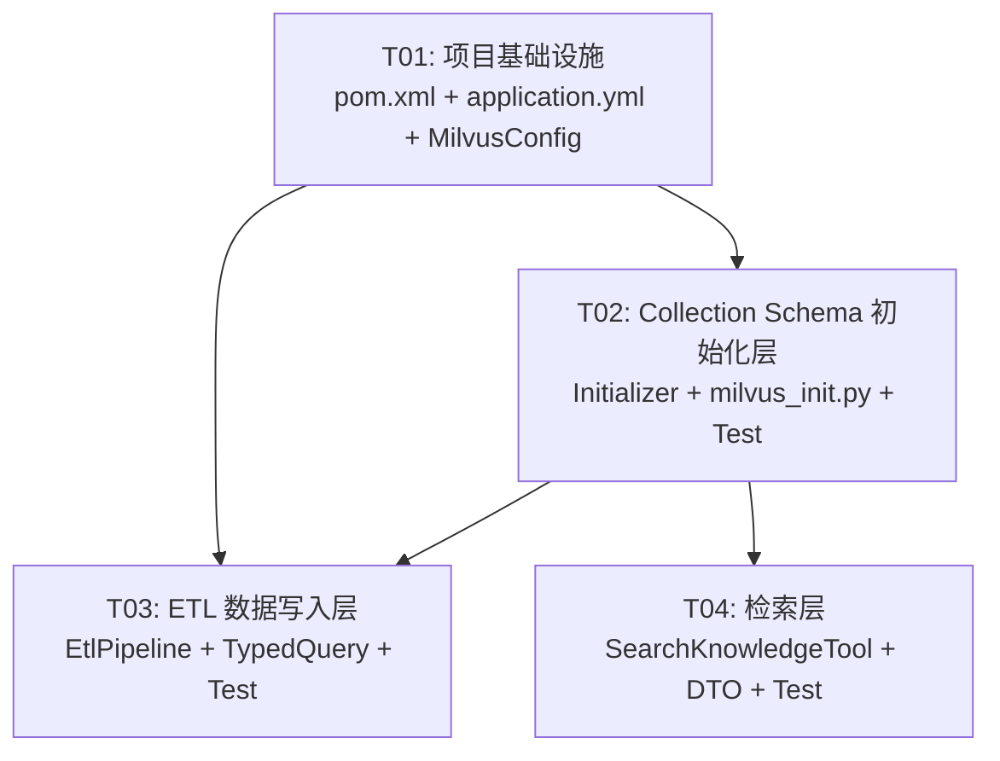

# Milvus Collection 偏离修正 — 系统设计文档

> 架构师：高见远 | 日期：2026-07-23
> 项目：commerce-customer/backend | 后端根目录：`D:\code\py\project\commerce-customer\backend`

---

## Part A: System Design

### 1. Implementation Approach

#### 1.1 核心技术挑战

现有后端代码的 Milvus Collection 实现**系统性偏离**了设计文档（db-schema.md 第 759-797 行），涉及 3 个主代码文件 + 1 个 Python 脚本 + 3 个测试文件，偏差覆盖字段定义、索引配置、检索逻辑、插入逻辑全链路。

关键技术难点：
1. **Sparse 向量方案**：设计文档要求 `sparse_vector (SPARSE_FLOAT_VECTOR) — BM25 (Milvus 2.5 chinese analyzer)`，需服务端 BM25 Function 自动生成
2. **Dense + Sparse 混合检索**：需 `hybridSearch` API 同时检索两个向量字段并用 RRF 融合
3. **权限过滤表达式**：需支持 `course_id IN [...]` + `DEFAULT OR` 逻辑
4. **SDK 版本兼容性**：现有 SDK 2.4.8 是否支持上述所有 API

#### 1.2 SDK 兼容性验证结果（Q1-Q5，全部通过 javap 实证）

> 验证对象：`milvus-sdk-java-2.4.8.jar`（本地 Maven 仓库）
> 验证方法：`javap -cp` 反编译 class 文件

| 编号 | 问题 | 实证结论 | 状态 |
|------|------|---------|------|
| Q1 | SDK 2.4.8 是否支持 `SparseFloatVector` 数据类型？ | `io.milvus.grpc.DataType` 枚举包含 `SparseFloatVector` 值 | ✅ 支持 |
| Q2 | SDK 2.4.8 是否支持 Function/BM25 服务端生成？ | jar 中**无** `FunctionType` 枚举、**无** `Function` 类；v1 `FieldType` 无 analyzer 支持；v2 `AddFieldReq`（2.4.8 版）**无** `enableAnalyzer` 字段 | ❌ 不支持 |
| Q3 | SDK 2.4.8 是否支持 `hybridSearch` API？ | `MilvusClient.hybridSearch(HybridSearchParam)` 存在；`AnnSearchParam.Builder` 有 `withSparseFloatVectors(List<SortedMap<Long,Float>>)` 和 `withFloatVectors(List<List<Float>>)`；`RRFRanker.Builder` 有 `withK()` | ✅ 支持（v1 API） |
| Q4 | SDK 2.4.8 是否支持 `SPARSE_INVERTED_INDEX`？ | `io.milvus.param.IndexType` 枚举包含 `SPARSE_INVERTED_INDEX`（及 `SPARSE_WAND`） | ✅ 支持 |
| Q5 | SDK 2.4.8 是否支持 BM25 analyzer 配置？ | **无** analyzer 配置 API；`AddFieldReq`（2.4.8 版）无 `enableAnalyzer`/`analyzerParams` 字段 | ❌ 不支持 |

**关键发现**：SDK 2.4.8 支持 sparse 向量的**数据类型、索引、混合检索 API**，但**不支持**服务端 BM25 Function（自动从文本生成 sparse 向量）。Function API（`FunctionType`、`CreateCollectionReq.Function`、`enableAnalyzer`）是 SDK 2.5+ 新增功能。

#### 1.3 技术方案决策

##### 决策 1：SDK 升级 2.4.8 → 2.6.11

**理由**：
- 设计文档明确要求 `BM25 (Milvus 2.5 chinese analyzer)`，即服务端 BM25 Function
- SDK 2.4.8 实证不支持 Function API（Q2/Q5）
- Milvus 服务端为 `v2.6.19`（docker-compose.yml），SDK 2.6.x 兼容 2.6.x 服务端
- 官方兼容表：`Milvus 2.6.x → Java SDK 2.6.11`（GitHub README）
- 项目**直接使用** Milvus SDK（非通过 SAA Vector Store 抽象），SDK 升级与 SAA 解耦
- 升级后可直接使用 v2 API 的 `Function.builder().functionType(FunctionType.BM25)` + `AddFieldReq.enableAnalyzer(true)`

**目标版本**：`io.milvus:milvus-sdk-java:2.6.11`（2025-12 发布，兼容 Milvus 2.6.x）

**风险评估**：
| 风险项 | 等级 | 说明 | 缓解措施 |
|--------|------|------|---------|
| v1 API 废弃 | 低 | SDK 2.6.x 保留 v1 API（`MilvusServiceClient`）向后兼容，但官方推荐 v2 | 全部迁移到 v2 API（`MilvusClientV2`），不混用 |
| protobuf 版本冲突 | 低 | SDK 2.6.x 可能升级 protobuf/grpc 版本 | 升级后执行 `mvn dependency:tree` 检查冲突 |
| SAA 传递依赖 | 无 | 项目 pom.xml 直接声明 milvus-sdk，SAA 无 milvus 依赖 | 无需处理 |
| API 差异大 | 中 | v1→v2 是全量 API 变更（客户端类、参数类、返回类全换） | 本设计文档提供精确的 v2 API 调用示例 |

##### 决策 2：v1 → v2 API 全量迁移

**v1 → v2 API 对照表**：

| 关注点 | v1 API (2.4.8) | v2 API (2.6.x) |
|--------|----------------|----------------|
| 客户端类 | `MilvusServiceClient(ConnectParam)` | `MilvusClientV2(ConnectConfig)` |
| 连接配置 | `ConnectParam.withHost().withPort()` | `ConnectConfig.builder().uri("http://host:port")` |
| 创建 Collection | `CreateCollectionParam` + 独立 `createIndex()` | `CreateCollectionReq` + `indexParams`（一步到位） |
| 字段定义 | `FieldType.newBuilder()...build()` | `AddFieldReq.builder()...build()` |
| Function | ❌ 不支持 | `schema.addFunction(Function.builder().functionType(BM25)...)` |
| 插入 | `InsertParam.Field(name, List<?>)` | `InsertReq.builder().data(List<JsonObject>)`（Gson 行式） |
| 单路检索 | `SearchParam` + `SearchResultsWrapper` | `SearchReq` + `SearchResp` |
| 混合检索 | `HybridSearchParam` + `AnnSearchParam` | `HybridSearchReq` + `AnnSearchReq` |
| Sparse 检索输入 | `withSparseFloatVectors(List<SortedMap<Long,Float>>)` | `new EmbeddedText(queryText)`（服务端自动生成） |
| 删除 | `DeleteParam` + `withExpr()` | `DeleteReq.builder().filter(expr)` |

**关键差异**：v2 API 使用 **Gson JsonObject 行式插入**（非列式 Field），**索引随 Collection 一起创建**（非独立 createIndex），**BM25 检索用 EmbeddedText 包装查询文本**（服务端自动转 sparse 向量）。

##### 决策 3：Sparse 向量 — 服务端 BM25 Function

**方案**：使用 Milvus 服务端 BM25 Function 自动生成 sparse 向量

```
content (VARCHAR, enableAnalyzer=true)
    ↓ Function(BM25)
sparse_vector (SPARSE_FLOAT_VECTOR) ← 服务端自动生成
```

**ETL 插入时**：只需插入 `content` 文本，服务端自动生成 `sparse_vector`，**无需外部生成 sparse 向量**。

**检索时**：dense 路用 `FloatVec` 包装 embedding 向量，sparse 路用 `EmbeddedText` 包装查询文本，服务端分别检索后由 RRF 融合。

**否决的替代方案**：外部生成 BM25 sparse 向量（需引入 jieba 中文分词 + BM25 IDF 词典 + term→Long 哈希映射，代码量大、维护成本高、且偏离设计文档"Milvus 2.5 chinese analyzer"的意图）。

##### 决策 4：混合检索 — v2 hybridSearch + RRFRanker

```
hybridSearch:
  ├── AnnSearchReq(dense_vector, FloatVec, COSINE, HNSW, topK=20)
  ├── AnnSearchReq(sparse_vector, EmbeddedText, BM25, topK=20)
  └── RRFRanker(k=60) → 融合后 topK=20
```

#### 1.4 架构模式

保持现有 MVC + 工具分层架构：
- `config/` — Milvus 客户端配置 + Collection 初始化器
- `etl/` — ETL 管道（文档解析 → 分片 → 向量化 + Milvus 插入）
- `bot/tool/` — LLM Agent 工具（知识检索）
- `bot/tool/dto/` — 检索结果 DTO

---

### 2. File List

| # | 文件路径（相对 backend/） | 操作 | 说明 |
|---|--------------------------|------|------|
| 1 | `pom.xml` | 修改 | SDK 版本 2.4.8 → 2.6.11 |
| 2 | `src/main/resources/application.yml` | 修改 | 新增 `milvus.sparse-bm25-k` 等配置项 |
| 3 | `src/main/java/com/commerce/rag/config/MilvusConfig.java` | 修改 | `MilvusServiceClient` → `MilvusClientV2` |
| 4 | `src/main/java/com/commerce/rag/config/MilvusCollectionInitializer.java` | 重写 | v2 API：12 字段 schema + BM25 Function + 4 索引 |
| 5 | `src/main/resources/scripts/milvus_init.py` | 重写 | pymilvus v2 API：同上 |
| 6 | `src/main/java/com/commerce/rag/bot/tool/TypedQuery.java` | 修改 | `courseId: String` → `courseIds: List<String>` |
| 7 | `src/main/java/com/commerce/rag/bot/tool/dto/KnowledgeSearchResult.java` | 修改 | KnowledgeChunk 新增 docId/kbId/chunkIndex/tokenCount 字段 |
| 8 | `src/main/java/com/commerce/rag/bot/tool/SearchKnowledgeTool.java` | 重写 | v2 hybridSearch + IN 过滤表达式 |
| 9 | `src/main/java/com/commerce/rag/etl/EtlPipeline.java` | 修改 | v2 InsertReq（12 字段，server 生成 sparse） |
| 10 | `src/test/java/com/commerce/rag/config/MilvusCollectionInitializerTest.java` | 重写 | 适配 v2 API Mock |
| 11 | `src/test/java/com/commerce/rag/bot/tool/SearchKnowledgeToolTest.java` | 重写 | 适配 v2 hybridSearch Mock |
| 12 | `src/test/java/com/commerce/rag/etl/EtlPipelineTest.java` | 修改 | 适配 v2 InsertReq Mock |

---

### 3. Data Structures and Interfaces

> 详见 `docs/class-diagram.mermaid`

#### 3.1 核心类

**MilvusConfig**（修改）
- Bean 类型从 `MilvusClient` → `MilvusClientV2`
- 连接方式：`ConnectConfig.builder().uri("http://{host}:{port}").build()`

**MilvusCollectionInitializer**（重写）
- 注入 `MilvusClientV2`（替代 `MilvusClient`）
- `buildCreateCollectionParam()` → `buildCreateCollectionReq()`：12 字段 + BM25 Function + 4 索引一步创建
- 不再需要独立的 `createVectorIndex()` / `createScalarIndex()`（v2 随 Collection 一起创建）
- 新增 `loadCollection()` 步骤

**SearchKnowledgeTool**（重写）
- 注入 `MilvusClientV2`
- `searchSingle()` → v2 `hybridSearch()`：dense（FloatVec）+ sparse（EmbeddedText）+ RRFRanker
- `buildFilterExpression()`：支持 `course_id in [...]` + `DEFAULT OR` 逻辑
- `OUTPUT_FIELDS`：10 个标量字段（去掉 `source`，新增 `doc_id/kb_id/chunk_index/token_count/updated_at`）

**EtlPipeline**（修改）
- 注入 `MilvusClientV2`
- `insertToMilvus()`：v2 `InsertReq` + Gson `JsonObject` 行式插入（12 字段，不含 sparse_vector）
- `deleteFromMilvusByChunkId()`：v2 `DeleteReq.builder().filter(expr)`

**TypedQuery**（修改）
- `courseId: String` → `courseIds: List<String>`（已选课程 ID 列表）

**KnowledgeSearchResult.KnowledgeChunk**（修改）
- 新增：`docId`, `kbId`, `chunkIndex`, `tokenCount`
- 移除：`source`（设计文档无此字段，改由 PG doc_id 关联查询文档标题）

#### 3.2 字段名常量约定

所有 Milvus 字段名常量**集中定义在 `MilvusCollectionInitializer`** 中（`public static final`），`SearchKnowledgeTool` 和 `EtlPipeline` 引用这些常量，确保三方一致：

```java
// MilvusCollectionInitializer.java
public static final String FIELD_CHUNK_ID = "chunk_id";
public static final String FIELD_DOC_ID = "doc_id";
public static final String FIELD_KB_ID = "kb_id";
public static final String FIELD_CONTENT = "content";
public static final String FIELD_HEADING_PATH = "heading_path";
public static final String FIELD_DENSE_VECTOR = "dense_vector";
public static final String FIELD_SPARSE_VECTOR = "sparse_vector";
public static final String FIELD_CHUNK_INDEX = "chunk_index";
public static final String FIELD_TOKEN_COUNT = "token_count";
public static final String FIELD_COLLECTION_TYPE = "collection_type";
public static final String FIELD_COURSE_ID = "course_id";
public static final String FIELD_UPDATED_AT = "updated_at";
```

---

### 4. Program Call Flow

> 详见 `docs/sequence-diagram.mermaid`

#### 4.1 混合检索流程（SearchKnowledgeTool.searchSingle）

```
LLM Agent
  → SearchKnowledgeTool.searchKnowledge(List<TypedQuery>)
    → searchInParallel(queries)  // CompletableFuture 并行
      → searchSingle(query)
        1. embeddingModel.embed(query.queryText()) → float[] denseVector
        2. buildFilterExpression(query)
           → "collection_type == 'TECHNICAL_QA' and
              (course_id == 'DEFAULT' or course_id in ['C1','C2'])"
        3. 构建 AnnSearchReq(dense):
             data=FloatVec(denseVector), vectorFieldName="dense_vector"
             metricType=COSINE, params={"ef":64}, topK=20
        4. 构建 AnnSearchReq(sparse):
             data=EmbeddedText(query.queryText()), vectorFieldName="sparse_vector"
             metricType=BM25, topK=20
        5. 构建 HybridSearchReq:
             searchRequests=[denseReq, sparseReq]
             ranker=RRFRanker(k=60), topK=20
             filter=expr, outputFields=OUTPUT_FIELDS
        6. milvusClientV2.hybridSearch(hybridSearchReq) → SearchResp
        7. 解析 SearchResp.getSearchResults() → List<KnowledgeChunk>
    → fusionService.fuse(rawResults)  // 跨查询 RRF 融合
    → rerankService.rerank(anchorQuery, fused)  // 精排
    → KnowledgeSearchResult
```

#### 4.2 ETL 插入流程（EtlPipeline.embedAndIndex → insertToMilvus）

```
EtlPipeline.process(docId)
  → parseDocument(docId)     // Tika 解析
  → chunkDocument(docId)     // 递归分片 → PG
  → embedAndIndex(docId)
    → deleteFromMilvusByDocId(docId)  // 先删旧
    → for each chunk:
        1. embeddingModel.embed(chunk.content) → float[] denseVector
        2. 更新 PG dense_vector (BYTEA)
        3. insertToMilvus(chunk, denseVector):
           构建 Gson JsonObject 行:
             chunk_id, doc_id, kb_id, content, heading_path,
             dense_vector (List<Float>), chunk_index, token_count,
             collection_type, course_id, updated_at
           // 注意：不插入 sparse_vector —— 服务端 BM25 Function 自动生成
           milvusClientV2.insert(InsertReq.builder()
             .collectionName("knowledge_chunks")
             .data(List.of(rowJson))
             .build())
```

---

### 5. Anything UNCLEAR

#### 5.1 已选课程 ID 列表的注入方式（需用户决策）

设计文档要求 `course_id IN ['已选课程ID1', ...]`，但 `SearchKnowledgeTool` 是 LLM Agent 工具（通过 SAA `methodTools` 注册），LLM 无法得知学生已选课程列表。

**设计方案**：`TypedQuery.courseIds` 由**调用方**（LeadAgentGraph 的前置节点）从 `EnrollmentService.findStudentCourses(studentId)` 获取后注入。

**待明确**：
- (a) SAA `methodTools` 是否支持注入非 LLM 参数（如从 graph state 读取 courseIds 填充）？
- (b) 是否需要用 ThreadLocal 在请求上下文中传递 studentId → courseIds？
- (c) 或者 `SearchKnowledgeTool` 直接注入 `EnrollmentService`，在工具内部解析？

**建议**：方案 (c) — `SearchKnowledgeTool` 注入 `EnrollmentService` + 从 SecurityContext/ThreadLocal 获取 studentId，内部解析 courseIds。但这增加了工具的职责，需确认是否可接受。

**临时方案**（T04 实现时使用）：`TypedQuery.courseIds` 为可选参数，LLM 可不填（默认 null）。当 `courseIds == null` 时，过滤表达式仅 `collection_type == "X"`（不过滤 course_id）。当非 null 时，追加 `(course_id == "DEFAULT" or course_id in [...])`。课程权限注入作为后续迭代。

#### 5.2 v2 API 标量索引类型

v2 `IndexParam.IndexType` 中标量字段索引类型：设计文档只说"标量索引"未指定类型。v1 用 `TRIE`，v2 推荐 `INVERTED`（支持更多操作符）。本设计采用 `INVERTED`。若 v2 不支持 `INVERTED` for VARCHAR，可回退为不指定 indexType（auto）。

#### 5.3 `source` 字段移除后的文档标题获取

新 schema 无 `source` 字段（设计文档未定义）。现有 `KnowledgeChunk.source`（文档标题）需改为通过 PG `document.title` 关联查询（`doc_id` → title）。是否在 `SearchKnowledgeTool` 中批量查询 PG，还是移到前端关联，需确认。

**建议**：`KnowledgeChunk` 保留 `source` 字段但标记为 `@Deprecated`，当前设为空字符串。后续在 `SearchKnowledgeTool` 中添加批量 PG 查询（`doc_id IN [...]` → `Map<docId, title>`）填充。

#### 5.4 v2 API 方法签名未实证

本设计基于 Milvus 官方文档和 GitHub 示例代码（`FullTextSearchExample.java`）推断 v2 API 方法签名。SDK 2.6.11 jar 未在本地 Maven 仓库（仅有 2.4.8），**工程师实现前需先执行 `mvn dependency:resolve` 下载 2.6.11 jar**，再用 `javap` 验证以下关键方法签名：
- `MilvusClientV2.hybridSearch(HybridSearchReq)`
- `MilvusClientV2.createCollection(CreateCollectionReq)`
- `MilvusClientV2.insert(InsertReq)`
- `MilvusClientV2.delete(DeleteReq)`
- `MilvusClientV2.loadCollection(LoadCollectionReq)`
- `AnnSearchReq.builder()` 的 `.data()`, `.vectorFieldName()`, `.metricType()`, `.limit()`
- `HybridSearchReq.builder()` 的 `.searchRequests()`, `.ranker()`, `.limit()`, `.outputFields()`, `.filter()`

---

## Part B: Task Decomposition

### 6. Required Packages

| 包 | 版本 | 用途 | 变更 |
|----|------|------|------|
| `io.milvus:milvus-sdk-java` | `2.6.11`（从 `2.4.8` 升级） | Milvus 向量数据库客户端（v2 API + BM25 Function） | **升级** |
| `com.google.code.gson:gson` | Spring Boot 管理（已传递依赖） | v2 API 插入用 `JsonObject` 行式数据 | 无需新增（Spring Boot starter 已含） |
| `org.apache.tika:tika-parsers-standard-package` | `2.9.2`（不变） | 文档解析 | 无变更 |
| `com.baomidou:mybatis-plus-spring-boot3-starter` | `3.5.12`（不变） | PG 数据访问 | 无变更 |

**pom.xml 修改**：
```xml
<properties>
    <milvus-sdk.version>2.6.11</milvus-sdk.version>  <!-- 从 2.4.8 升级 -->
</properties>
```

---

### 7. Task List (ordered by dependency)

#### T01: 项目基础设施 — SDK 升级 + 配置 + 客户端 Bean

- **Source Files**:
  - `pom.xml` — `<milvus-sdk.version>` 2.4.8 → 2.6.11
  - `src/main/resources/application.yml` — 新增 `milvus.sparse-bm25-k: 60`（RRF k 参数）
  - `src/main/java/com/commerce/rag/config/MilvusConfig.java` — `MilvusServiceClient(ConnectParam)` → `MilvusClientV2(ConnectConfig)`
- **Dependencies**: 无
- **Priority**: P0
- **具体改动**:
  1. `pom.xml`：修改 `<milvus-sdk.version>` 属性值为 `2.6.11`
  2. `application.yml`：在 `milvus:` 节点下新增 `sparse-bm25-k: 60`（RRF 融合常数）
  3. `MilvusConfig.java`：
     - import 从 `io.milvus.client.MilvusServiceClient` → `io.milvus.v2.client.MilvusClientV2` + `io.milvus.v2.client.ConnectConfig`
     - Bean 返回类型 `MilvusClient` → `MilvusClientV2`
     - 连接构建：`ConnectConfig.builder().uri("http://" + host + ":" + port).build()` → `new MilvusClientV2(connectConfig)`
     - 保留 `@Value` 注入 host/port，保持 application.yml 兼容

#### T02: Collection Schema 初始化层 — 12 字段 + BM25 Function + 4 索引

- **Source Files**:
  - `src/main/java/com/commerce/rag/config/MilvusCollectionInitializer.java` — v2 API 重写
  - `src/main/resources/scripts/milvus_init.py` — pymilvus v2 API 重写
  - `src/test/java/com/commerce/rag/config/MilvusCollectionInitializerTest.java` — 适配 v2 Mock
- **Dependencies**: T01
- **Priority**: P0
- **具体改动**:
  1. `MilvusCollectionInitializer.java`：
     - 注入 `MilvusClientV2`（替代 `MilvusClient`）
     - **公开字段名常量**（`public static final`，供 SearchKnowledgeTool / EtlPipeline 引用）
     - `buildCreateCollectionReq()`：v2 `CreateCollectionReq.CollectionSchema` + `AddFieldReq`
       - 12 个字段（见下方修正后 Schema）
       - `content` 字段：`.enableAnalyzer(true)`
       - `sparse_vector` 字段：`DataType.SparseFloatVector`（无 dim）
       - BM25 Function：`schema.addFunction(Function.builder().functionType(FunctionType.BM25).name("bm25_func").inputFieldNames(List.of("content")).outputFieldNames(List.of("sparse_vector")).build())`
     - 索引随 Collection 一起创建：`CreateCollectionReq.builder().collectionSchema(schema).indexParams(indexParams)`
       - 4 个 `IndexParam`：dense(HNSW/COSINE), sparse(SPARSE_INVERTED_INDEX/BM25), collection_type(INVERTED), course_id(INVERTED)
     - 移除独立的 `createVectorIndex()` / `createScalarIndex()` 方法
     - 新增 `loadCollection()` 调用（v2 `LoadCollectionReq`）
  2. `milvus_init.py`：
     - 使用 pymilvus v2 API：`MilvusClient(uri=...)` + `client.create_schema()` + `schema.add_field()` + `schema.add_function()` + `client.prepare_index_params()` + `client.create_collection()`
     - 12 字段 + BM25 Function + 4 索引
  3. `MilvusCollectionInitializerTest.java`：
     - Mock `MilvusClientV2`（替代 `MilvusClient`）
     - 验证 `createCollection(CreateCollectionReq)` 调用（含 indexParams）
     - 验证 `loadCollection()` 调用
     - 保留三条测试路径：不存在→创建、已存在→跳过、异常→降级

#### T03: ETL 数据写入层 — v2 插入 + 12 字段

- **Source Files**:
  - `src/main/java/com/commerce/rag/etl/EtlPipeline.java` — v2 InsertReq + DeleteReq
  - `src/main/java/com/commerce/rag/bot/tool/TypedQuery.java` — courseIds 列表
  - `src/test/java/com/commerce/rag/etl/EtlPipelineTest.java` — 适配 v2 Mock
- **Dependencies**: T01, T02
- **Priority**: P0
- **具体改动**:
  1. `EtlPipeline.java`：
     - 注入 `MilvusClientV2`
     - `VECTOR_FIELD_NAME` 常量：`"embedding"` → 引用 `MilvusCollectionInitializer.FIELD_DENSE_VECTOR`（`"dense_vector"`）
     - `insertToMilvus(chunk, vector, docTitle)`：
       - 构建 Gson `JsonObject` 行（v2 行式插入）：
         - `chunk_id` = `String.valueOf(chunk.getId())`
         - `doc_id` = `String.valueOf(chunk.getDocId())`
         - `kb_id` = `String.valueOf(chunk.getKbId())`
         - `content` = `chunk.getContent()`（截断至 65535）
         - `heading_path` = `chunk.getHeadingPath()`
         - `dense_vector` = `List<Float>`（从 float[] 转换）
         - `chunk_index` = `chunk.getChunkIndex()`
         - `token_count` = `chunk.getTokenCount()`
         - `collection_type` = `chunk.getCollectionType()`
         - `course_id` = `chunk.getCourseId()`
         - `updated_at` = `System.currentTimeMillis() / 1000`（Unix 秒）
         - **不插入 `sparse_vector`** — 服务端 BM25 Function 自动生成
       - `milvusClientV2.insert(InsertReq.builder().collectionName(COLLECTION_NAME).data(List.of(rowJson)).build())`
     - `deleteFromMilvusByChunkId()`：v2 `DeleteReq.builder().collectionName().filter("chunk_id == \"...\"")`
  2. `TypedQuery.java`：
     - `courseId: String` → `courseIds: List<String>`
     - 更新 JavaDoc
  3. `EtlPipelineTest.java`：
     - Mock `MilvusClientV2`（替代 `MilvusClient`）
     - 验证 `insert(InsertReq)` 和 `delete(DeleteReq)` 调用

#### T04: 检索层 — v2 混合检索 + IN 权限过滤

- **Source Files**:
  - `src/main/java/com/commerce/rag/bot/tool/SearchKnowledgeTool.java` — v2 hybridSearch
  - `src/main/java/com/commerce/rag/bot/tool/dto/KnowledgeSearchResult.java` — KnowledgeChunk 新增字段
  - `src/test/java/com/commerce/rag/bot/tool/SearchKnowledgeToolTest.java` — 适配 v2 Mock
- **Dependencies**: T01, T02
- **Priority**: P0
- **具体改动**:
  1. `SearchKnowledgeTool.java`：
     - 注入 `MilvusClientV2`（替代 `MilvusClient`）
     - `VECTOR_FIELD_NAME` → 引用 `MilvusCollectionInitializer.FIELD_DENSE_VECTOR`
     - 新增 `SPARSE_FIELD_NAME` = `MilvusCollectionInitializer.FIELD_SPARSE_VECTOR`
     - `OUTPUT_FIELDS`：10 个标量字段（去掉 `source`，新增 `doc_id/kb_id/chunk_index/token_count/updated_at`）
     - `searchSingle(query)`：
       - 构建两个 `AnnSearchReq`：
         - dense：`.data(List.of(new FloatVec(denseVector))).vectorFieldName("dense_vector").metricType(MetricType.COSINE).params("{\"ef\":64}").limit(20)`
         - sparse：`.data(List.of(new EmbeddedText(query.queryText()))).vectorFieldName("sparse_vector").metricType(MetricType.BM25).limit(20)`
       - 构建 `HybridSearchReq`：`.searchRequests(List.of(denseReq, sparseReq)).ranker(RRFRanker.builder().k(60).build()).limit(20).filter(expr).outputFields(OUTPUT_FIELDS)`
       - `milvusClientV2.hybridSearch(hybridSearchReq)` → `SearchResp`
       - 解析 `SearchResp.getSearchResults()` → `List<KnowledgeChunk>`
     - `buildFilterExpression(query)`：
       - 基础：`collection_type == "TECHNICAL_QA"`
       - 有 courseIds：追加 ` and (course_id == "DEFAULT" or course_id in ["C1","C2"])`
       - 表达式用 Milvus 语法：`==`、`and`、`or`、`in ["..."]`
  2. `KnowledgeSearchResult.java`：
     - `KnowledgeChunk` record 新增：`docId(String)`, `kbId(String)`, `chunkIndex(int)`, `tokenCount(int)`
     - `source` 字段保留但标记 `@Deprecated`（当前设为空字符串，后续从 PG 填充）
  3. `SearchKnowledgeToolTest.java`：
     - Mock `MilvusClientV2`（替代 `MilvusClient`）
     - 验证 `hybridSearch(HybridSearchReq)` 调用
     - 验证过滤表达式包含 `in` 和 `DEFAULT`
     - 适配 `SearchResp` 返回结构

---

### 8. Shared Knowledge

#### 8.1 字段名常量

所有 Milvus 字段名常量**集中定义在 `MilvusCollectionInitializer`**（`public static final`）。`SearchKnowledgeTool` 和 `EtlPipeline` **必须引用这些常量**，禁止硬编码字段名字符串。这确保三方（Schema 定义 / 插入 / 检索）字段名一致。

#### 8.2 Collection 名称

```java
// 三处共用（MilvusCollectionInitializer / SearchKnowledgeTool / EtlPipeline）
// 当前各自定义 private static final String COLLECTION_NAME = "knowledge_chunks"
// 建议统一引用 MilvusCollectionInitializer.COLLECTION_NAME（改为 public）
```

#### 8.3 向量字段命名

- **dense_vector**（FLOAT_VECTOR, dim=1024）— DashScope text-embedding-v4 输出
- **sparse_vector**（SPARSE_FLOAT_VECTOR）— Milvus 服务端 BM25 Function 自动生成
- 旧名 `embedding` **全局废弃**，所有引用改为 `dense_vector`

#### 8.4 v2 API 约定

- 客户端类型：`MilvusClientV2`（全局唯一 Milvus Bean）
- 插入方式：Gson `JsonObject` 行式（非 `InsertParam.Field` 列式）
- 索引创建：随 `createCollection` 一步完成（`indexParams` 参数）
- sparse 检索：用 `EmbeddedText(queryText)` 包装（非 `SortedMap<Long, Float>`）
- BM25 metric：sparse 索引和检索的 metricType 均为 `BM25`（非 `IP`）

#### 8.5 过滤表达式语法

Milvus 表达式使用 `==`、`and`、`or`、`in [...]`（**小写关键字**）：
```
collection_type == "TECHNICAL_QA" and (course_id == "DEFAULT" or course_id in ["C1", "C2"])
```

#### 8.6 updated_at 时间戳

`updated_at` 为 INT64，存储 **Unix epoch 秒**（`System.currentTimeMillis() / 1000`）。

#### 8.7 content 截断

Milvus VARCHAR max_length=65535。ETL 插入前需截断 `content`：`content.length() > 65535 ? content.substring(0, 65535) : content`。完整内容在 PG `document_chunk.content`（TEXT，无限制）。

---

### 9. Task Dependency Graph



**执行顺序**：T01 → T02 → (T03 ∥ T04)

- T01 是基础（SDK + 客户端 Bean），必须最先完成
- T02 依赖 T01（需要 v2 客户端创建 Collection）
- T03 和 T04 都依赖 T01 + T02（需要正确 schema + v2 客户端），但 T03 和 T04 之间**无依赖**，可并行

---

## 附录：修正后的完整 Milvus Collection Schema

```
Collection: knowledge_chunks

字段（12 个）：
  ┌──────────────────┬──────────────────────┬──────────────────────────────────┐
  │ 字段名            │ 类型                 │ 约束 / 备注                      │
  ├──────────────────┼──────────────────────┼──────────────────────────────────┤
  │ chunk_id         │ VARCHAR(64)          │ Primary Key, autoID=false        │
  │ doc_id           │ VARCHAR(64)          │ 文档 ID（PG document.id 字符串） │
  │ kb_id            │ VARCHAR(64)          │ 知识库 ID（PG document.kb_id）   │
  │ content          │ VARCHAR(65535)       │ enableAnalyzer=true ← BM25 输入  │
  │ heading_path     │ VARCHAR(500)         │ 标题导航路径                     │
  │ dense_vector     │ FLOAT_VECTOR(1024)   │ text-embedding-v4 dense 向量     │
  │ sparse_vector    │ SPARSE_FLOAT_VECTOR  │ 服务端 BM25 Function 自动生成    │
  │ chunk_index      │ INT32                │ 分片序号                         │
  │ token_count      │ INT32                │ token 数量                       │
  │ collection_type  │ VARCHAR(20)          │ TECHNICAL_QA / COURSE_INFO       │
  │ course_id        │ VARCHAR(64)          │ DEFAULT / 具体课程 ID            │
  │ updated_at       │ INT64                │ Unix epoch 秒                    │
  └──────────────────┴──────────────────────┴──────────────────────────────────┘

Function（1 个）：
  - name: "bm25_func"
  - type: BM25
  - input: ["content"]
  - output: ["sparse_vector"]

索引（4 个，随 Collection 一起创建）：
  ┌──────────────────┬──────────────────────┬──────────────────────────────────┐
  │ 字段              │ 索引类型             │ 度量类型 / 参数                   │
  ├──────────────────┼──────────────────────┼──────────────────────────────────┤
  │ dense_vector     │ HNSW                 │ COSINE, M=16, efConstruction=200 │
  │ sparse_vector    │ SPARSE_INVERTED_INDEX│ BM25                             │
  │ collection_type  │ INVERTED             │ —（标量索引）                    │
  │ course_id        │ INVERTED             │ —（标量索引）                    │
  └──────────────────┴──────────────────────┴──────────────────────────────────┘

检索过滤表达式：
  collection_type == "TECHNICAL_QA"
    and (course_id == "DEFAULT" or course_id in ["C1", "C2", ...])

混合检索：
  hybridSearch(
    AnnSearchReq(dense_vector, FloatVec, COSINE, HNSW, topK=20),
    AnnSearchReq(sparse_vector, EmbeddedText, BM25, topK=20),
    RRFRanker(k=60), topK=20
  )
```

---

## 附录：SDK 兼容性验证原始记录

### Q1: SparseFloatVector DataType（✅ 支持）

```
$ javap -cp milvus-sdk-java-2.4.8.jar io.milvus.grpc.DataType
public static final io.milvus.grpc.DataType SparseFloatVector;
```

### Q2: Function/BM25 API（❌ 不支持）

```
$ jar tf milvus-sdk-java-2.4.8.jar | grep -iE "FunctionType|Function"
（无 FunctionType 枚举、无 Function 类）

$ javap AddFieldReq（2.4.8 版）
（无 enableAnalyzer / analyzerParams 字段）
```

### Q3: hybridSearch API（✅ 支持 v1）

```
$ javap MilvusClient
public abstract R<SearchResults> hybridSearch(HybridSearchParam);

$ javap AnnSearchParam$Builder
public Builder withSparseFloatVectors(List<SortedMap<Long, Float>>);
public Builder withFloatVectors(List<List<Float>>);

$ javap RRFRanker$Builder
public Builder withK(Integer);
```

### Q4: SPARSE_INVERTED_INDEX（✅ 支持）

```
$ javap io.milvus.param.IndexType
public static final IndexType SPARSE_INVERTED_INDEX;
public static final IndexType SPARSE_WAND;
```

### Q5: BM25 analyzer 配置（❌ 不支持）

```
$ javap AddFieldReq（2.4.8 版）
（无 enableAnalyzer / analyzerParams 方法）
```

### SDK 版本兼容表（GitHub README 实证）

```
Milvus 2.5.x → Java SDK 2.5.15
Milvus 2.6.x → Java SDK 2.6.11
```

### v2 API Function 示例（官方文档 + GitHub 实证）

```java
// 来源：https://github.com/milvus-io/milvus-sdk-java FullTextSearchExample.java
import io.milvus.common.clientenum.FunctionType;
import io.milvus.v2.service.collection.request.CreateCollectionReq.Function;

schema.addField(AddFieldReq.builder()
    .fieldName("text").dataType(DataType.VarChar)
    .maxLength(65535).enableAnalyzer(true).build());
schema.addField(AddFieldReq.builder()
    .fieldName("sparse").dataType(DataType.SparseFloatVector).build());
schema.addFunction(Function.builder()
    .functionType(FunctionType.BM25).name("function_bm25")
    .inputFieldNames(Collections.singletonList("text"))
    .outputFieldNames(Collections.singletonList("sparse")).build());

// 索引
IndexParam.builder().fieldName("sparse")
    .indexType(IndexParam.IndexType.SPARSE_INVERTED_INDEX)
    .metricType(IndexParam.MetricType.BM25).build();

// 插入：只插入 text，不插入 sparse
client.insert(InsertReq.builder().collectionName(...)
    .data(List.of(jsonObject)).build());

// 检索：用 EmbeddedText 包装查询文本
client.search(SearchReq.builder()
    .data(Collections.singletonList(new EmbeddedText(text))).build());
```
